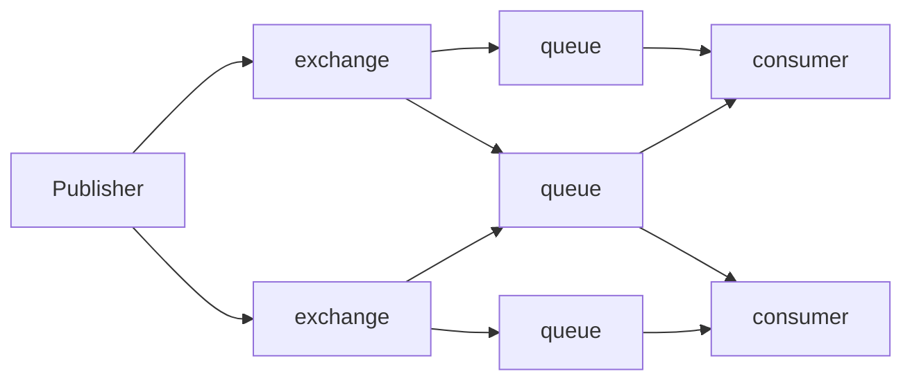
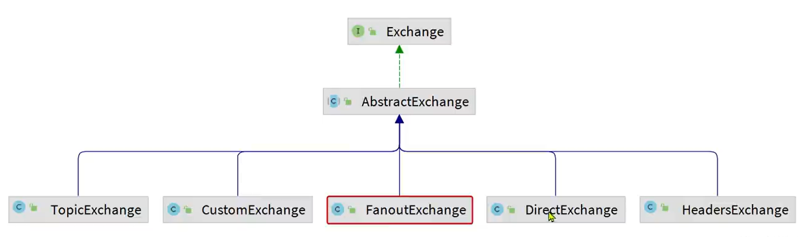

# RabbitMq

## 1.初识Mq

### 1.1 同步调用

>同步调用：客户端需要等待服务端响应，服务端需要等待客户端请求。

- 性能下降: 同步调用需要等待服务端响应，服务端需要等待客户端请求,对于用户直观体验来讲.便是卡半天。
- 拓展性差: 若一个功能分为若干个步骤，则每个步骤都需要一个服务，若要增加新的业务,则需要在在原本代码上不断新增代码,拓展性较差且随着功能增多,用户等待时间会越长。

### 1.2 异步调用

>异步调用：客户端不需要等待服务端响应，服务端也不需要等待客户端请求。消息代理负责管理、暂存、转发消息。

- 性能提升: 异步调用不需要等待服务端响应，服务端也不需要等待客户端请求,用户体验良好。
- 解除耦合：降低不同服务之间耦合度，减少代码维护成本。
- 削峰填谷：缓存消息，平衡流量。

### 1.3 基本框架

- publisher --> exchange --> queue --> consumer
- publisher: 消息发送者
- exchange: 交换机
- queue: 队列
- consumer: 消费者



- virtual host: 虚拟主机，可以理解为MQ中的数据库，可以创建多个虚拟主机，每个虚拟主机可以创建多个队列，每个队列可以绑定多个交换机。

### 1.4 Spring AMQP

- Spring AMQP是Spring官方提供的用于与RabbitMQ进行交互的框架。

#### 1.4.1 引入依赖

```xml
<!-- RabbitMQ -->
<dependency>
    <groupId>org.springframework.boot</groupId>
    <artifactId>spring-boot-starter-amqp</artifactId>
</dependency>
```

#### 1.4.2 操作对象

`private RabbitTemplate rabbitTemplate;`

## 2 基本特性

### 2.1 work模型

在一个队列上绑定多个消费者

work模型主要用于在多个消费者之间分配工作负载,以实现负载均衡和提高任务处理效率,但他会均匀分配消息,但缺点是如果消费者处理时间过长,则会导致消息堆积,从而影响其他消费者。spring-rabbitmq默认是work模型

默认情况下,RabbitMQ会将消息依次轮询发送给消费者,如果消费者处理时间过长,则会导致消息堆积,从而影响其他消费者。

- 修改配置:

```yaml
spring:
  rabbitmq:
    listener:
        simple:
            prefetch: 1 # 每次只处理一个消息,处理完后再处理下一个消息,每个消费者每次拉取的消息数量
```

能者多劳
修改完后,队列中的消息不会均匀分配给消费者,而是会只要消费者处理完上一个就分配下一个消息。

### 2.1.2 影响因素

- 吞吐量：较大的 prefetchCount 可以提高消息的处理吞吐量，因为消费者可以一次性获取更多的消息，减少了频繁从队列中拉取消息的开销。
- 延迟：较小的 prefetchCount 会导致消费者频繁从队列中拉取消息，可能增加消息的处理延迟，但有助于在消息处理失败时更快速地重新分配消息。
- 内存使用：较大的 prefetchCount 可能导致消费者在内存中积累大量未处理的消息，增加内存使用。对于内存资源有限的系统，过大的 prefetchCount 可能会带来压力。
- 公平性：较小的 prefetchCount 可以确保消息在多个消费者之间更公平地分配，避免某个消费者因为预取过多消息而占用过多资源。

### 2.1.3 调优建议

根据具体的应用场景和需求，可以调整 prefetchCount 的大小来优化性能：

- 高吞吐量应用：如果应用对吞吐量要求较高，可以设置较大的 prefetchCount（如 50 或 100）。这可以减少消息拉取的开销，提高整体处理速度。
- 低延迟应用：如果应用对延迟要求较高，或者需要确保消息处理的公平性，可以设置较小的 prefetchCount（如 1 到 5）。这可以确保消息能够迅速被不同的消费者获取和处理。
- 资源受限环境：在内存或其他资源受限的环境中，可以设置中等大小的 prefetchCount（如 10 到 20）。这样既能提高处理效率，又不会占用过多的内存资源。

### 2.2 交换机

- Fanout: 将消息发送给所有绑定到交换机的队列
  - 会转发给所有的绑定的队列
- Direct: 将消息发送给匹配到的队列
  - 会根据路由键进行匹配
  - 可以一个路由键对应多个队列,那么每个队列都会接收到消息
  - 也可以一个队列对应多个路由键,那么这个队列会收到所有路由传来的消息
- Topic: 将消息发送给匹配到的队列
  - routeKey: 模糊匹配
  - 模糊匹配规则:
  - `*`: 任意一个字符
  - `#`: 任意多个字符

## 3.交换机和队列的创建

### 3.1 Configuration创建

SpringAMQP提供了几个类，用来声明队列、交换机及其绑定关系：

- Queue：用于声明队列，可以用工厂类QueueBuilder构建
- Exchange：用于声明交换机，可以用工厂类ExchangeBuilder构建
- Binding：用于声明队列和交换机的绑定关系，可以用工厂类BindingBuilder构建



```java
@Configuration
public class RabbitMqConfig {
    @Bean
    public DirectExchange emailExchange(){
        return ExchangeBuilder.directExchange(@Value(email.exchange)).durable(true).build();
    }
    @Bean
    public Queue emailQueue(){
        return QueueBuilder.durable(email.queue).build();
    }
    @Bean
    public Binding emailBinding(){
        //调用emailQueue()方法会直接从容器中获取emailQueue()对象
        return BindingBuilder.bind(emailQueue()).to(emailExchange()).with(email.routingKey);
    }
}
```

### 3.2 Annotation创建

```java
@RabbitListener(
    bindings = {
        @QueueBinding(
            value = @Queue(name = "mail.queue1", durable = "true"),
            exchange = @Exchange(name = "mail.direct", type = ExchangeTypes.DIRECT),
            key = {"mail1", "mail2"}
        ),
        @QueueBinding(
            value = @Queue(name = "mail.queue2", durable = "true"),
            exchange = @Exchange(name = "mail.direct", type = ExchangeTypes.DIRECT),
            key = {"mail3", "mail4"}
        ),
        @QueueBinding(
            value = @Queue(name = "mail.queue3", durable = "true"),
            exchange = @Exchange(name = "mail.direct", type = ExchangeTypes.DIRECT),
            key = {"mail5"}
        )
    },
    concurrency = "3-10"
)
```

>这样的绑定是以队列为中心,每个队列绑定交换机,再绑定路由键。

## 4.json序列化

默认情况下,RabbitMQ只支持字节数组和字符串作为消息内容,如果需要发送其他类型的消息,需要使用json序列化。

可以通过引入jackson-databind依赖来使用json序列化。(3.3.2版本在web依赖里面就有)

```xml
<dependency>
    <groupId>com.fasterxml.jackson.core</groupId>
    <artifactId>jackson-databind</artifactId>
</dependency>
```

添加以下配置项

```java
    @Bean
    public MessageConverter jacksonMessageConverter() {
        return new Jackson2JsonMessageConverter();
    }
```
