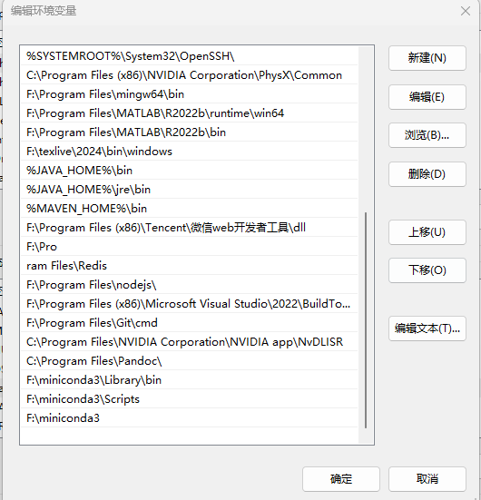
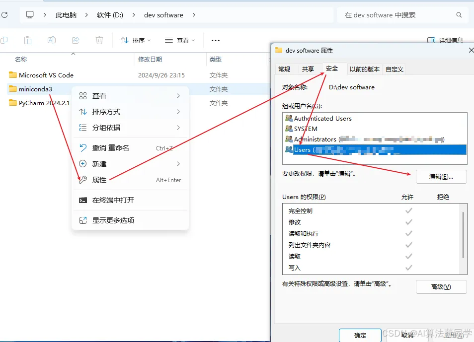
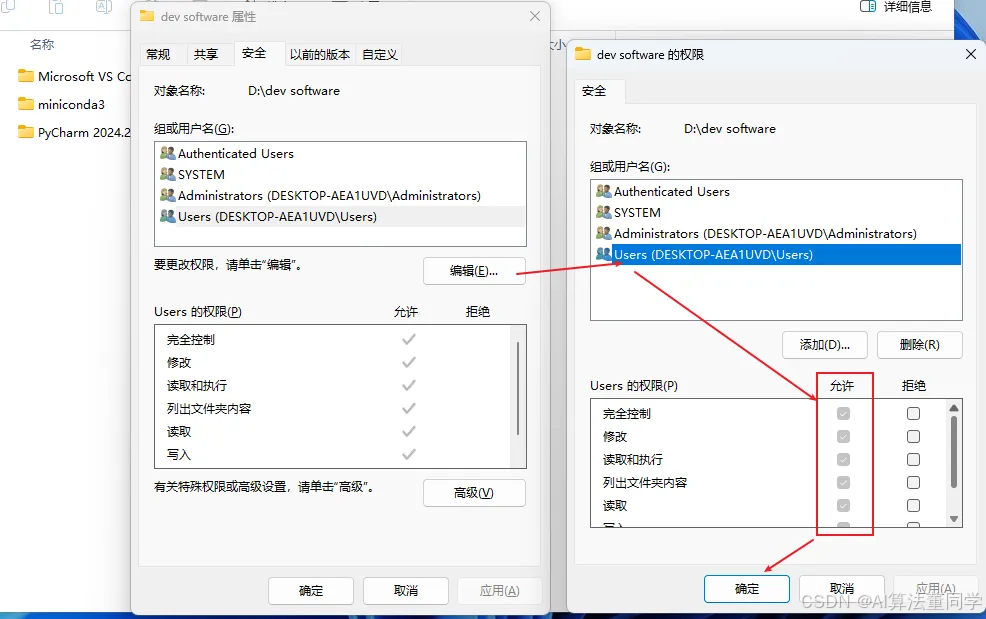

# conda 配置

## 首先添加环境变量



## PowerShell

`conda init`

## 然后配置默认env的路径

`conda config --add envs_dirs F:\miniconda3\envs`





## 修改conda 频道

```sh
# 清理冗余配置
conda config --remove-key channels

# 添加 conda-forge 和 defaults
conda config --add channels defaults
conda config --add channels conda-forge
```

## 创建`intelligent_system`环境

```sh
conda deactivate

conda config --add envs_dirs F:\miniconda3\envs

conda remove --name intelligent_system --all

conda create -n intelligent_system python=3.9
conda activate intelligent_system
pip install git+https://github.com/buguroo/pyknow.git

pip install hawksoft.trafficLights
```

