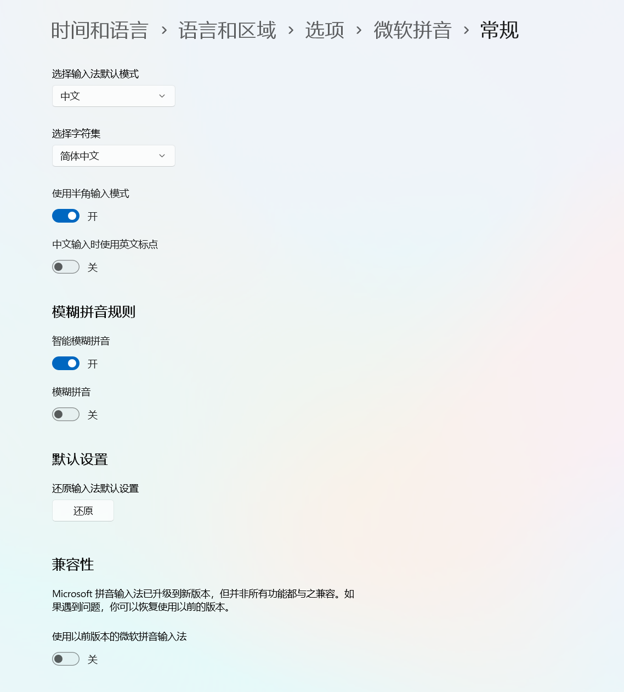

# idea技巧

## ctrl + H

查看注解参数

## alt+f8

在debug模式下查看变量

## 从历史选择粘贴

`Ctrl + Shift + V`

## 复制行

`Ctrl + D`

## 复制文件路径

`Ctrl + Shift + C`

## 自动缩进到规范位置

`Ctrl + Alt + I`

## 开启新行无论光标是否在末尾

`Shift + Enter`

## 显示建议操作

`Alt + Enter`

## 参数类型提醒

`Ctrl + P`

## 快速文档

`Ctrl + Q`

## 添加块注释

`Ctrl + Shift + /`

## 查找所有

双击`Shift`

## 查找当前文件

`Ctrl + F`

## 替换

`Ctrl + R`

## 跳转到声明

`Ctrl + B`

## 跳转到声明类

`Ctrl + Shift + B`

## 跳转到实现

`Ctrl + Alt + B`

## 查看继承关系图

`Ctrl + Alt + U`

## 查看继承关系图(新窗口)

`Ctrl + Alt + Shift + U`

## 查看类结构图

`Ctrl + H`

## 快速定位到错误或警告

`F2`

## 将选中的代码使用 if、while、try/catch 等代码块包装起来（功能强大）

`Ctrl + Alt + T`

## 批量替换变量名

`Shift + F6`

> 注意：若是新版微软输入法,快捷键会因为冲突而失效,需要在输入法设置中修改为旧版输入法

