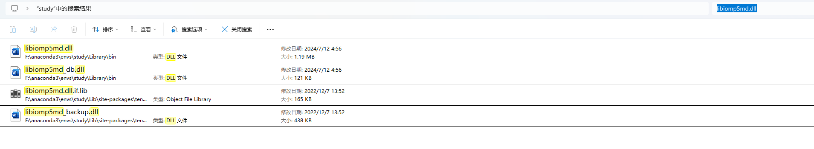

# tensorflow的配置

```sh
conda create -n study python=3.10  # 创建名为 myenv 的环境，指定 Python 版本  cpu版本
conda activate study             # 激活环境
conda install -c conda-forge tensorflow==2.10.0 # cudatoolkit=11.2 cudnn=8.1  #在conda下，tensorflow 2.10.0已被下架
conda install -c conda-forge jupyter notebook
```

> TensorFlow 2.10 是最后一个支持 Windows GPU 的官方版本，2.11+ 开始，Windows 下只有 CPU 版。

> TensorFlow 从 2.0 起，`pip install tensorflow` 默认就包含 GPU 支持（需环境中有 CUDA 和 cuDNN 库）。

```sh
conda deactivate

conda remove --name study --all

```

## 初始化powershell

```sh
# 初始化
conda init
# 还原
conda init --reverse
```

## 修改conda频道

```sh
# 清理冗余配置
conda config --remove-key channels

# 添加 conda-forge 和 defaults
conda config --add channels defaults
conda config --add channels conda-forge

# 设置严格优先级
# conda config --set channel_priority strict

# 验证
conda config --show channels
conda config --show channel_priority
```

## gpu的tensorflow

```sh
conda create --name tf python=3.9
conda activate tf
conda install -c conda-forge cudatoolkit=11.2 cudnn=8.1.0
pip install --upgrade pip
# Anything above 2.10 is not supported on the GPU on Windows Native
pip install "tensorflow<2.11" data
# 不支持numpy 2.x版本
pip install numpy==1.24.3
# 验证
python -c "import tensorflow as tf; print(tf.config.list_physical_devices('GPU'))"


```

## libiomp5md.dll冲突问题

- 直接在虚拟环境下搜索`libiomp5md.dll`

  

- 然后backup

## malaria env

```sh
# 创建 conda 环境
conda create --name tf python=3.9 -y
conda activate tf

# 安装 CUDA 和 cuDNN（从 conda-forge）
conda install -c conda-forge cudatoolkit=11.2 cudnn=8.1.0 -y

# 升级 pip
pip install --upgrade pip

# 安装 TensorFlow 2.10 及 data（data 是你自定义的包名吗？如果不是，可能 pip 会报错）
pip install "tensorflow<2.11" tensorflow_datasets==4.8.2

# 安装兼容的 numpy 版本
pip install numpy==1.24.3 -y

# 安装常用数据科学库以及jupyter
conda install pandas seaborn matplotlib jupyter -y

# 验证 GPU 是否可用
python -c "import tensorflow as tf; print(tf.config.list_physical_devices('GPU'))"
```

## 配置wsl2

```sh
wsl.exe --install -d Ubuntu-24.04
wsl --export Ubuntu-24.04 F:\WSL\ubuntu-24.04.tar
wsl --unregister Ubuntu-24.04
wsl --import Ubuntu-24.04 F:\WSL\Ubuntu F:\WSL\ubuntu-24.04.tar
wsl --list --verbose
```


## wsl中配置conda

```sh
# 如果是root则省略
# sudo su
wget https://repo.anaconda.com/miniconda/Miniconda3-latest-Linux-x86_64.sh
bash Miniconda3-latest-Linux-x86_64.sh
echo 'export PATH="$HOME/miniconda3/bin:$PATH"' >> ~/.bashrc
source ~/.bashrc
conda --version

conda init
source /root/miniconda3/etc/profile.d/conda.sh
conda activate base


```

## wsl中配置tensorflow

```sh
# 创建 conda 环境
conda create --name tf python=3.12 -y
conda activate tf

conda install -c conda-forge tensorflow=2.16.1 tensorflow_datasets
conda update --all

# 安装常用数据科学库以及jupyter
conda install pandas seaborn matplotlib jupyter notebook -y

# 验证 GPU 是否可用
python -c "import tensorflow as tf; print(tf.config.list_physical_devices('GPU'))"
```

## pycharm中jupyter配置

```sh
# jupyter的sever中配置 添加--alow-root
notebook --no-browser --allow-root
```

## wsl-crash

`C:\Users\vesper\AppData\Local\Temp\wsl-crashes`
