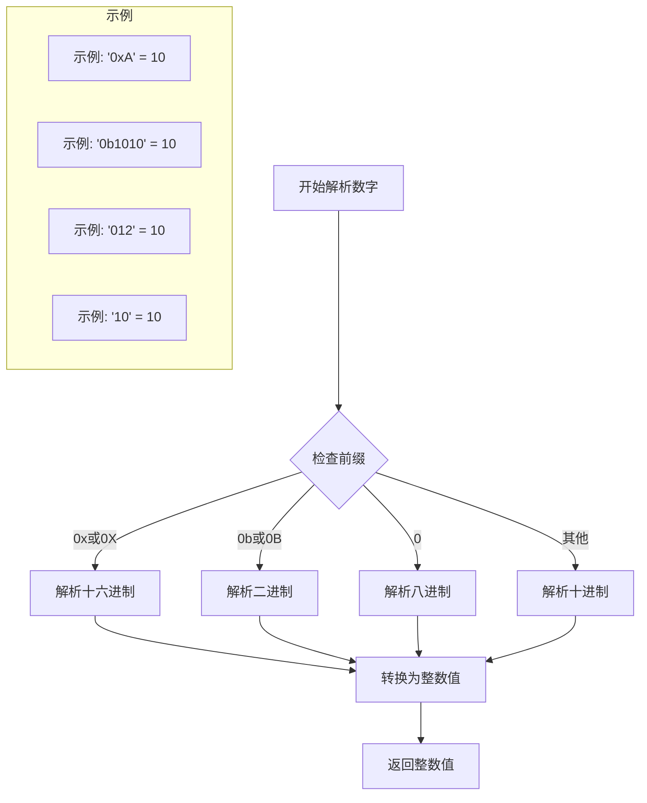

```mermaid
flowchart TD
    Start[开始解析数字] --> CheckPrefix{检查前缀}
    CheckPrefix -- "0x或0X" --> Hex[解析十六进制]
    CheckPrefix -- "0b或0B" --> Binary[解析二进制]
    CheckPrefix -- "0" --> Octal[解析八进制]
    CheckPrefix -- "其他" --> Decimal[解析十进制]
    
    Hex --> Convert[转换为整数值]
    Binary --> Convert
    Octal --> Convert
    Decimal --> Convert
    
    Convert --> Return[返回整数值]
    
    subgraph 示例
    Example1["示例: '0xA' = 10"]
    Example2["示例: '0b1010' = 10"]
    Example3["示例: '012' = 10"]
    Example4["示例: '10' = 10"]
    end
```

