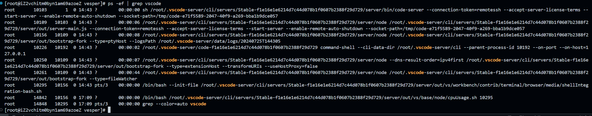

# 关于vocoed中remote-ssh远程连接服务器内存占用问题

## 1. 问题背景

在vocoed中，使用remote-ssh插件远程连接服务器时，发现内存占用较高，在没有安装任何插件的情况下，内存占用对于一个4G的服务器达到了700M。对于性能的影响已经不可忽视

## 2. 解决方案

### 2.1 等待自动结束进程

```sh
# 在远程服务器上执行以下命令
ps -ef | grep vscode
```

可以发现如下结果


- 其中第一个进程时主进程，后面的进程都是链式启动的
- 第一个进程已经配置了--enable-remote-auto-shutdown ，所以即使不主动结束进程，当退出连接一段时间后，该进程也会主动结束，经过测试，一晚上是可以自动结束的，2到3个小时是不可以的。

>所以第一个解决方案就是不管他，会自动结束

### 2.2 主动结束进程

可以在服务器上创建一个sh脚本如下：

```sh
#!/bin/bash

# 获取 VS Code 服务器的 PID
PIDS=$(ps -ef | grep vscode | grep -v grep | awk '{print $2}')

# 终止所有 VS Code 服务器进程
if [ ! -z "$PIDS" ]; then
  echo "Terminating VS Code server processes..."
  kill -9 $PIDS
  echo "VS Code server processes terminated."
else
  echo "No VS Code server processes found."
fi
```

当vsccode断开与服务器的连接时，可以使用其他的轻量远程连接，如windows自带的终端，连接后执行上述sh命令
