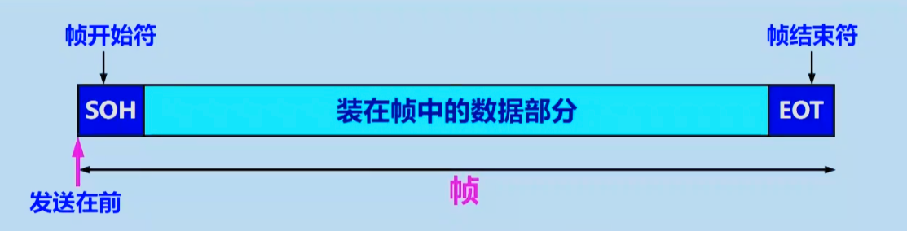
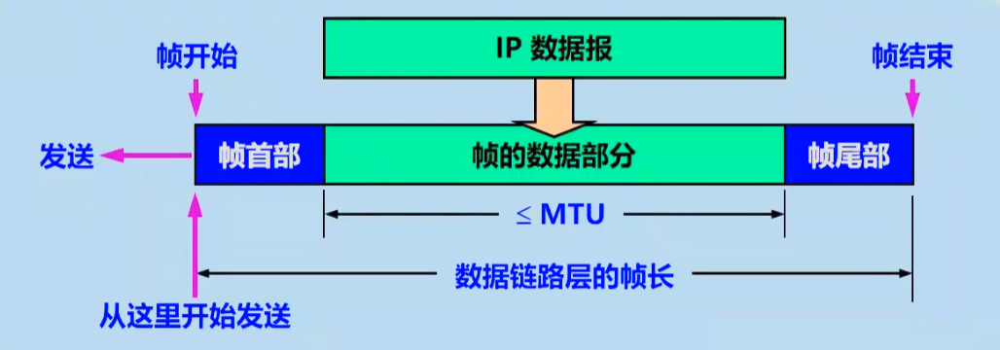
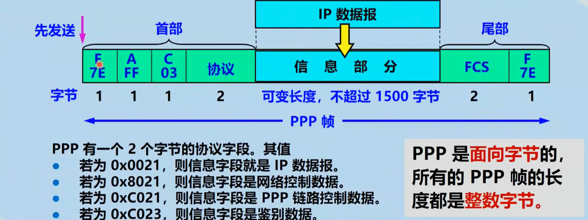
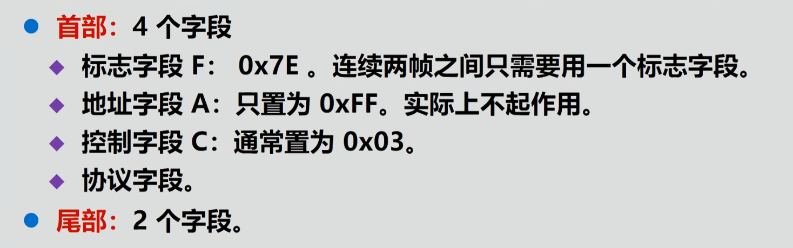
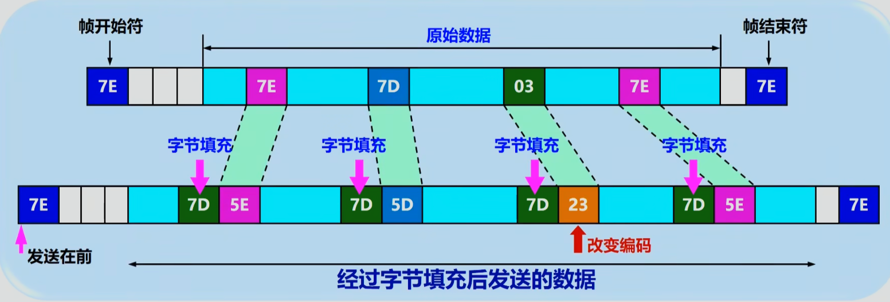

# 计算机网络

## 数据链路层

### 封装成帧

- 首尾添加定界符（7E）

- MTU
- 帧首部和尾部

### 透明传输

>透明传输意味着一个存在的事物在某个层面上看起来好像不存在。例如，在数据链路层的透明传输中，无论数据如何组合，都能够通过数据链路层而不被察觉。这种传输方式确保了数据在传输过程中不被干扰和改变，从而对于数据链路层来说是“透明的”。

### 差错检测

- 比特差错
  - 误码率:一段时间内,传输错误比特占总比特的比率
- CRC循环校验码:CRC 的工作原理基于二进制除法，假定数据为k位,事先商量好的除数P为n+1位,则发送k+n位数据,即k+R:其中n位为(k添上n个0后)/除数P得到的余数R

### PPP

- 帧格式

- 其中协议字段的多样性使得PPP协议可以支持多种网络层协议

- 标志字段无意义,就是界定符,地址字段无意义,控制字段无意义,协议字段有意义
- 透明传输(字节填充)

- 零比特填充则是连续五个1就插零

### 以太网

