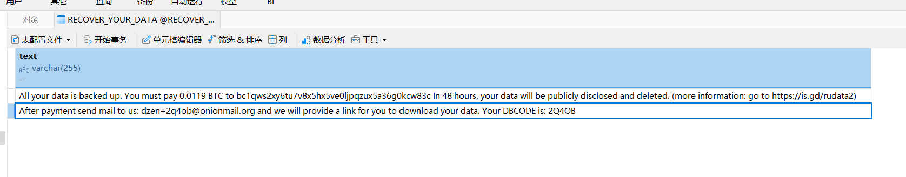
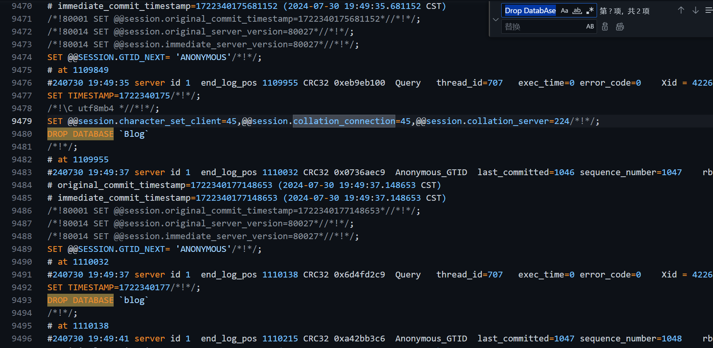

# 记录mysql被勒索

## 1.背景

2024/7/30 23:00左右，网站数据加载不出来

## 2.排查

查看mysql数据库，发现被删库了并且留下了勒索信息

居然要支付0.018比特币，太离谱。直接开始恢复数据过程。

## 3.恢复数据

经检查，数据库文件被删除，但是binlog日志还存在，所以可以尝试使用binlog日志进行恢复。

1. `mysqlbinlog --stop-datetime='2024-07-30 15:30:00' /var/lib/mysql/binlog.000001 >/var/lib/mysql/before_delete.sql`:因为下午三点左右没有进行过数据库操作，所以从三点开始恢复,且不知道具体删库时间,所以先从三点开始恢复
2. 检查`before_delete.sql`文件,直接执行说不定会报错,因为不确定什么时候删库的,通过全局搜索"DROP DATABASE"和"DROP TABLE"关键字,发现没找到,那就先恢复再说
3. `mysql -u root -p < /var/lib/mysql/before_delete.sql`:恢复数据

## 4.后续

1. 再次执行`mysqlbinlog --start-datetime='2024-07-30 15:00:00' --stop-datetime='2024-07-30 23:30:00' /var/lib/mysql/binlog.000001 >/var/lib/mysql/before_delete.sql`:从三点开始恢复,到23点结束,检查`before_delete.sql`文件,发现在240730 19:49:35 被删库

## 5.总结

1. 数据库文件被删,binlog日志存在,可以尝试使用binlog日志进行恢复
2. 恢复数据前,先检查一下binlog日志,防止删库时间点之之后的数据被恢复

>`SET PASSWORD FOR 'root'@'%' = 'password';`:修改root密码，可以有效防止数据库被勒索
