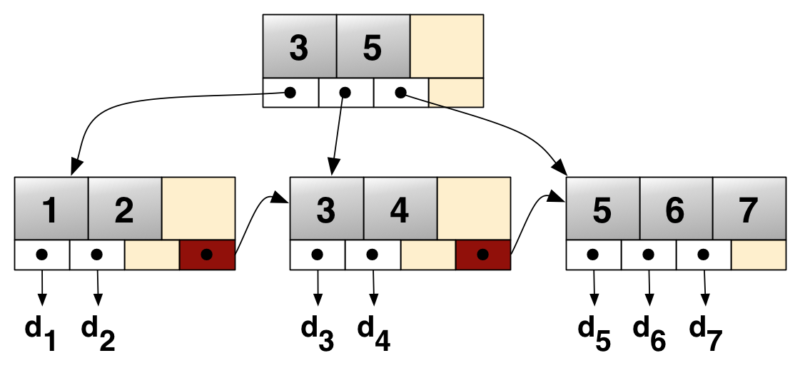
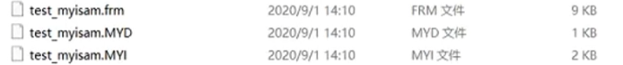
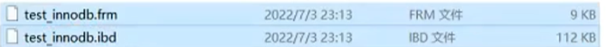

# 软路由

## 准备

- 刷好的openwrt系统

## ipv6

启用中继模式

## DNS

>避免dns泄露，让服务器进行dns解析

关闭本地dns服务器，然后追加上游dns


然后打开嗅探功能


## 订阅转换

>避免订阅泄露，所以可以将订阅密码修改后发送给在线转换网址，然后再得到转换后的地址后修改回来

可通过cloudflare自建worker来实现

[节点转换](https://convert.buqiuzzz.workers.dev/)

## 配置文件

先在proxy-groups下添加一个group

```yaml
proxy-groups:
  - name: 🔰 节点选择
    type: select
    proxies:
      - ♻️ 自动选择
      - 🎯 全球直连
      - 3x-ui-旧金山-不秋
```

再在rules里添加规则

```yaml
  - DOMAIN-SUFFIX,chatgpt.com,自定义规则
# 其中第一个是表示域名后缀匹配
# 第二个为域名
# 第三个为group的name
```

这样就可以让某些网站走特定的节点了

例子

```yaml
  - name: 🎯 全球直连
    type: select
    proxies:
      - DIRECT
  - name: 🛑 全球拦截
    type: select
    proxies:
      - REJECT
      - DIRECT
```

>其中图标为unicode编码的emoji

## 通用

- 绕过中国大陆:可以在插件设置->流量控制下启用，启用后大陆ip将不通过路由器内核

## 进阶篇

### samba

>用于nas服务

- 设置root用户

- 在配置文件中使root用户有效（默认root用户无效）

- 使用`smbpasswd -a root` 修改root用户密码
