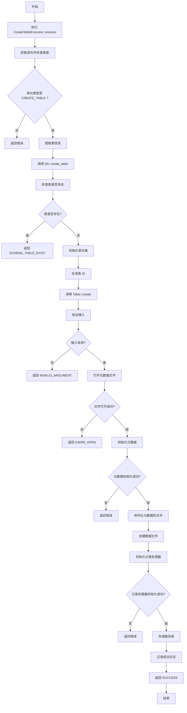

```mermaid
graph TD;
    A[开始] --> B[执行 CreateTableExecutor::execute]
    B --> C[获取语句并检查类型]
    C --> D{语句类型是 CREATE_TABLE ?}
    D -- 否 --> E[返回错误]
    D -- 是 --> F[提取表信息]
    F --> G[调用 Db::create_table]
    G --> H[检查表是否存在]
    H --> I{表是否存在?}
    I -- 是 --> J[返回 SCHEMA_TABLE_EXIST]
    I -- 否 --> K[初始化表对象]
    K --> L[生成表 ID]
    L --> M[调用 Table::create]
    M --> N[验证输入]
    N --> O{输入有效?}
    O -- 否 --> P[返回 INVALID_ARGUMENT]
    O -- 是 --> Q[打开元数据文件]
    Q --> R{文件打开成功?}
    R -- 否 --> S[返回 IOERR_OPEN]
    R -- 是 --> T[初始化元数据]
    T --> U{元数据初始化成功?}
    U -- 否 --> V[返回错误]
    U -- 是 --> W[序列化元数据到文件]
    W --> X[创建数据文件]
    X --> Y[初始化记录处理器]
    Y --> Z{记录处理器初始化成功?}
    Z -- 否 --> AA[返回错误]
    Z -- 是 --> AB[存储基目录]
    AB --> AC[记录成功日志]
    AC --> AD[返回 SUCCESS]
    AD --> AE[结束]
```